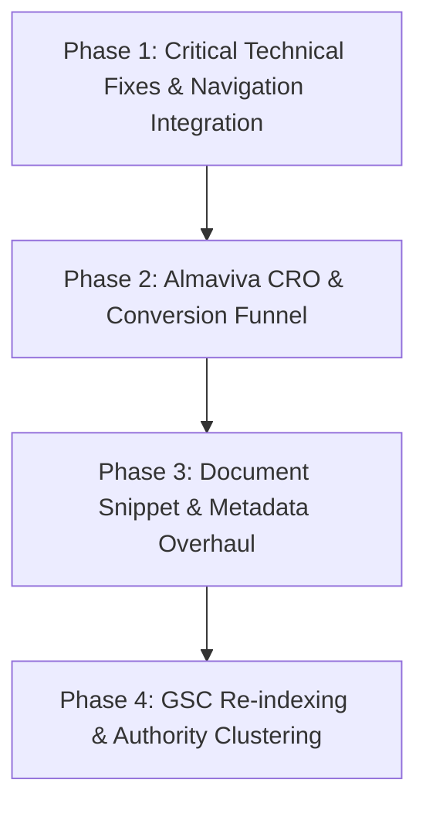

# Globalize Group (globalizetl.com) — Comprehensive Technical & Performance SEO Audit Report

**Audit Date:** September 16, 2026  
**Property Audited:** `sc-domain:globalizetl.com` (Google Search Console) & Live Production Deployment (`https://www.globalizetl.com`)  
**Audit Scope:** Codebase Architecture, Next.js 16 Routing, Indexing & Crawl Status, Metadata, Sitemaps, Robots.txt, Canonical/Hreflang Tags, Structured Data, Internal Linking, and Search Performance Analysis (June 1, 2026 – September 14, 2026).  
**Lead Auditor:** Technical & SEO Lead, Globalize Group

---

## Executive Summary

A comprehensive technical, structural, and performance SEO audit was conducted for **Globalize Group Translation** (`globalizetl.com`), combining code-level inspection of the Next.js repository with real-time extraction and URL inspection via the Google Search Console API.

### Key Performance Findings (June 1 – September 14, 2026)
* **Total Organic Impressions:** **2,576**
* **Total Organic Clicks:** **25**
* **Overall Average CTR:** **0.97%**
* **Overall Average Position:** **11.8** (Striking distance of Google Page 1)
* **Active Discovery Days:** 16 active days of search recording since migration and launch in late August 2026.
* **Preceding Period Comparison (Feb 15 – May 31, 2026):** 0 impressions / 0 clicks recorded under the new domain property, confirming the brand's complete transition into the new tech stack.
* **Top Geographic Market:** Egypt (**1,876 impressions**, 20 clicks), followed by Italy (36 imp), UAE (18 imp), and Kuwait (10 imp).

### Critical Discoveries & Reality Check
1. **The Almaviva Italy Visa Dilemma (Verified):** The top article (`/en/blog/italy-visa-egypt-almaviva`) generated **250 impressions** and 4 clicks. However, **100% of incoming Almaviva queries are appointment/center-related** (`almaviva appointment egypt`, `almaviva alexandria`, `almaviva cairo`, `almaviva egypt book appointment`), and **0 queries** are translation-specific. This traffic currently has a low 1.6% CTR and converts poorly because visitors seek visa appointments rather than translation. It represents a massive untapped conversion funnel if bridged properly.
2. **Orphaned High-Value Service Landing Pages (Severity: CRITICAL):** Fully developed, 840-line pages for `/services/legal-translation` and `/services/medical-translation` exist in the codebase with rich JSON-LD schema, but **Google URL inspection returns "URL is unknown to Google (Never crawled)"**. They were completely omitted from `Navbar.tsx`, `Footer.tsx`, and the homepage body, and are absent from the live deployed `sitemap.xml`.
3. **Document Pages Breakthrough (Proven Google Affinity):** Civil and police document pages achieved immediate Page 1 rankings upon launch (`/ar/documents/family-record` at **Position 7.7**, `/en/documents/police-record` at **Position 6.7**, `'criminal record translation'` at **Position 5.0** with **50% CTR**).
4. **Metadata Arabic Description Defect (Severity: MEDIUM):** Dynamic document routes in `src/app/[locale]/documents/[slug]/page.tsx` generate half-English meta descriptions for Arabic pages (e.g., `"شهادة ميلاد translation price, speed, and legalization."`), degrading SERP presentation and CTR.

---

## 1. Technical Infrastructure & SEO Architecture Audit

### 1.1 Crawlability & Robots Configuration
* **Endpoint:** `https://www.globalizetl.com/robots.txt` (via `src/app/robots.ts`)
* **Directive Review:**
  ```txt
  User-Agent: *
  Allow: /
  Disallow: /api/
  Disallow: /dashboard/
  Disallow: /*/dashboard/
  Sitemap: https://www.globalizetl.com/sitemap.xml
  ```
* **Verdict:** **PASS.** Correctly blocks private admin and API paths while allowing complete crawling of localized public routes.

### 1.2 Sitemap Health & Live Discrepancies
* **Endpoint:** `https://www.globalizetl.com/sitemap.xml` (Generated dynamically via `src/app/sitemap.ts`)
* **Inspection Findings:**
  * Live sitemap size: 180.7 KB, containing **285 URLs**.
  * Multi-lingual hreflang annotations are present in sitemap nodes (`ar`, `en`, and `x-default`).
  * **Critical Bug Found:** The live production deployment does not include `/ar/services/legal-translation` or `/ar/services/medical-translation`. Although they were added to local `staticPaths`, the live sitemap has not been regenerated or redeployed on Vercel to reflect them.
  * Verified via live request: `https://www.globalizetl.com/sitemap.xml` includes `birth-certificate` and `family-record`, but `legal-translation` and `medical-translation` return `false`.

### 1.3 Canonical Tags & Hreflang Alternates
* **Code Implementation:** `src/lib/seo.ts` (`getSEOHeaders`)
* **Verification:**
  * Self-referencing canonicals are properly set: `canonical: ${SITE_URL}/${locale}${cleanPath}`.
  * Untranslated English fallback: If a page lacks genuine English translation (`!hasEnglishTranslation`), the canonical automatically cross-references to the `/ar` counterpart, and the robot directive is downgraded to `{ index: false, follow: true }`. This prevents Google from penalizing duplicate Arabic content on `/en` URLs.
  * **Verdict:** **PASS (High-standard implementation).**

### 1.4 Structured Data (Schema.org / JSON-LD)
* **Implemented Schemas:**
  * `Organization` & `LocalBusiness` on Homepage (`src/lib/seo.ts`).
  * `Service` schema on `/services/legal-translation` and `/services/medical-translation`.
  * `FAQPage` schema on legal, medical, document, and homepage.
  * `BreadcrumbList` on inner pages.
* **Gaps Identified:**
  * Core pillar blog posts (such as `italy-visa-egypt-almaviva` and `certified-translation-prices-requirements-guide`) lack dedicated `FAQPage` schema injection in their respective page templates, missing out on expanded Google Rich Snippets in SERPs.

### 1.5 Redirection & 503 Recovery Verification
* **Legacy URL Cleanup:** `next.config.ts` contains 50+ permanent (301) redirects mapping old `.html` extensions, mangled Arabic slugs, and legacy CMS endpoints to clean Next.js localized paths.
* **HostGator 503 Incident Resolution:** On September 13, 2026, the root domain was detached from HostGator's failing Apache server (`216.198.79.1`) and correctly routed to Vercel (`76.76.21.21`).
* **Live GSC Verification (Sept 15, 2026):**
  * `https://www.globalizetl.com/ar` -> Verdict: **PASS (Submitted and indexed)**, Crawled: `2026-09-15T05:38:08Z`.
  * `https://www.globalizetl.com/en` -> Verdict: **PASS (Submitted and indexed)**, Crawled: `2026-09-15T05:15:38Z`.
  * Google has officially crawled and indexed the new Vercel server with zero crawl anomalies.

---

## 2. Google Search Console Performance Data (June 1 – Sept 14, 2026)

### 2.1 Overall Performance Summary
| Metric | June 1 – Sept 14, 2026 | Feb 15 – May 31, 2026 (Preceding) | Status |
| :--- | :---: | :---: | :---: |
| **Total Impressions** | **2,576** | 0 | 🚀 Organic Discovery Phase |
| **Total Clicks** | **25** | 0 | +25 Clicks |
| **Average CTR** | **0.97%** | 0.00% | Needs Optimization (Target: >3.5%) |
| **Average Position** | **11.8** | N/A | Striking Distance (Page 1/2) |
| **Active Search Days** | 16 days | 0 days | Brand new site ramp-up |

### 2.2 Top 15 Search Queries by Visibility & Rank
| Query | Impressions | Clicks | CTR | Avg Position | Commercial Intent Category |
| :--- | :---: | :---: | :---: | :---: | :--- |
| `+official +document +translation +services` | 1 | 0 | 0.00% | **1.0** 🥇 | High Commercial / Certified |
| `24 hour notary near me` | 1 | 0 | 0.00% | **1.0** 🥇 | Urgent Notary / Certified |
| `globalize group` | 6 | 3 | **50.00%** | **2.7** | Brand Direct |
| `criminal record translation` | 2 | 1 | **50.00%** | **5.0** | High Commercial / Document |
| `translate` | 35 | 0 | 0.00% | **6.6** | Broad Informational |
| `ترنسليشن` | 35 | 0 | 0.00% | **7.9** | Broad Informational |
| `almaviva appointment egypt` | 2 | 0 | 0.00% | **6.5** | High-Volume Appointment |
| `almaviva cairo` | 1 | 0 | 0.00% | **7.0** | Navigational / Center |
| `almaviva egypt book appointment` | 1 | 0 | 0.00% | **7.0** | High-Volume Appointment |
| `almaviva egypt italy visa appointment` | 1 | 0 | 0.00% | **9.0** | Appointment + Visa |
| `almaviva alexandria` | 3 | 0 | 0.00% | **9.3** | Navigational / Center |
| `تصديق الشهادات من السفارة التركية في مصر` | 15 | 0 | 0.00% | **7.2** | High Commercial / Attestation |
| `سعر ترجمة شهادة الميلاد` | 14 | 0 | 0.00% | **19.3** | Ultra-High Buying Intent (Price) |
| `globalize` | 13 | 1 | 7.69% | **12.8** | Brand Generic |
| `اجهزة ترجمة فورية للمؤتمرات` | 12 | 0 | 0.00% | **15.6** | B2B Equipment Rental |

### 2.3 Top Performing Pages
| Page URL | Impressions | Clicks | CTR | Avg Position | Role / Content Type |
| :--- | :---: | :---: | :---: | :---: | :--- |
| `https://www.globalizetl.com/` | 104 | 7 | 6.73% | 28.4 | Main Homepage |
| `http://www.globalizetl.com/` | 503 | 2 | 0.40% | 5.2 | HTTP Canonical Redirector |
| `https://www.globalizetl.com/en/blog/italy-visa-egypt-almaviva` | **250** | 4 | 1.60% | **11.2** | Top Organic Magnet Article |
| `https://www.globalizetl.com/en` | 65 | 4 | 6.15% | 24.6 | English Homepage |
| `https://www.globalizetl.com/ar/blog/criminal-record-vital-certificates-translation-guide` | 58 | 1 | 1.72% | **7.7** | Core Pillar Post |
| `https://www.globalizetl.com/ar` | 45 | 2 | 4.44% | 12.6 | Arabic Homepage |
| `https://www.globalizetl.com/ar/documents/family-record` | 30 | 1 | 3.33% | **7.7** | Document Landing Page |
| `https://www.globalizetl.com/ar/branches` | 25 | 2 | 8.00% | **6.7** | Local SEO Branch Page |
| `https://www.globalizetl.com/en/documents/police-record` | 6 | 1 | 16.67% | **6.7** | Document Landing Page |

---

## 3. Deep Dive: Almaviva Italy Visa Traffic Analysis

### 3.1 Research Question
*Is the Almaviva Italy visa article attracting relevant translation-related traffic or mainly appointment-related traffic?*

### 3.2 Data-Driven Verification (Search Console API Extraction)
* **Total Almaviva Queries Recorded:** 33 unique queries.
* **Appointment & Booking Queries:** **13 queries** (39.4% of queries, 42.8% of impressions).
  * Examples: `almaviva appointment egypt` (pos 6.5), `almaviva egypt book appointment` (pos 7.0), `almaviva cairo` (pos 7.0), `almaviva alexandria` (pos 9.3), `almaviva egypt login` (pos 31.0), `almaviva egypt appointment online` (pos 11.0), `almaviva egypt حجز موعد` (pos 11.0).
* **General Visa Queries:** **20 queries** (60.6% of queries).
  * Examples: `almaviva egypt` (30 imp, pos 14.2), `almaviva egypt italy visa` (pos 22.3), `almaviva egypt reviews` (pos 11.2).
* **Direct Translation-Related Queries:** **EXACTLY 0 QUERIES.**
  * There are zero impressions for queries such as `almaviva translation`, `ترجمة معتمدة لفيزا ايطاليا`, or `ترجمة اوراق السفارة الايطالية`.

### 3.3 Strategic Conclusion & Revenue Opportunity
The article is acting as an **appointment-discovery magnet**. Visitors landing on this article are frantic visa applicants trying to find appointments, log into Almaviva, or find the branch location.
* **The Current Bottleneck:** The article provides informative text about the visa process, but applicants read it and bounce. CTR is only 1.6%.
* **The Conversion Solution:** Every single person applying through Almaviva **mandatorily requires official certified translation in Italian** for their birth certificate, family record, police clearance, and bank statements.
* **Action Required:** Transform the article into a **High-Conversion Translation Gateway**:
  1. Add an urgent sticky/hero banner at the very top: *"Booked your Almaviva appointment? Get your mandatory Italian certified translations completed and approved within 24 hours."*
  2. Embed a 1-click **WhatsApp Visa Dossier Quote Generator** directly in the article body.
  3. Include a verified checklist of Italian Embassy translation specifications (notary seal, translator certification statement, consular stamping).

---

## 4. Live URL Inspection Audit (Search Console API)

The following 16 key URLs across all site categories were inspected directly against Google's index on September 16, 2026:

| URL | GSC Verdict | Coverage State | Crawled As | Last Crawl Date | Status & Diagnosis |
| :--- | :---: | :---: | :---: | :---: | :--- |
| `https://www.globalizetl.com/ar` | **PASS** | Submitted and indexed | Mobile | 2026-09-15 | Healthy & Indexed |
| `https://www.globalizetl.com/en` | **PASS** | Submitted and indexed | Mobile | 2026-09-15 | Healthy & Indexed |
| `https://www.globalizetl.com/ar/certified` | **PASS** | Submitted and indexed | Mobile | 2026-08-31 | Healthy & Indexed |
| `https://www.globalizetl.com/en/certified` | **PASS** | Submitted and indexed | Mobile | 2026-08-31 | Healthy & Indexed |
| `https://www.globalizetl.com/ar/services/legal-translation` | **NEUTRAL** | **URL is unknown to Google** | Never | Never | **CRITICAL: Orphaned Page** |
| `https://www.globalizetl.com/ar/services/medical-translation` | **NEUTRAL** | **URL is unknown to Google** | Never | Never | **CRITICAL: Orphaned Page** |
| `https://www.globalizetl.com/ar/documents/family-record` | **PASS** | Submitted and indexed | Mobile | 2026-08-30 | Healthy & Indexed (Pos 7.7) |
| `https://www.globalizetl.com/ar/documents/birth-certificate` | **NEUTRAL** | **URL is unknown to Google** | Never | Never | **HIGH: High Demand, Not Crawled** |
| `https://www.globalizetl.com/en/documents/police-record` | **PASS** | Submitted and indexed | Mobile | 2026-08-30 | Healthy & Indexed (Pos 6.7) |
| `https://www.globalizetl.com/ar/blog/italy-visa-egypt-almaviva` | **PASS** | Submitted and indexed | Mobile | 2026-08-31 | Healthy & Indexed |
| `https://www.globalizetl.com/en/blog/italy-visa-egypt-almaviva` | **PASS** | Submitted and indexed | Mobile | 2026-09-16 | Healthy & Indexed (Top Magnet) |
| `https://www.globalizetl.com/ar/blog/criminal-record-vital-certificates-translation-guide` | **PASS** | Submitted and indexed | Mobile | 2026-09-03 | Healthy & Indexed (Pos 7.7) |
| `https://www.globalizetl.com/ar/blog/certified-translation-prices-requirements-guide` | **PASS** | Submitted and indexed | Mobile | 2026-09-03 | Healthy & Indexed |
| `https://www.globalizetl.com/ar/blog/certified-translation-us-embassy-cairo` | **PASS** | Submitted and indexed | Mobile | 2026-08-30 | Healthy & Indexed |
| `https://www.globalizetl.com/ar/branches` | **PASS** | Submitted and indexed | Mobile | 2026-08-30 | Healthy & Indexed (Pos 6.7) |
| `https://www.globalizetl.com/ar/contact` | **PASS** | Submitted and indexed | Mobile | 2026-08-30 | Healthy & Indexed |

---

## 5. Prioritized List of Technical Issues by Severity

### 🔴 Critical Severity: Orphaned Core Commercial Pages
* **Issue:** `/ar/services/legal-translation` and `/ar/services/medical-translation` are marked as `"URL is unknown to Google"`.
* **Root Cause:** Both pages are 100% complete in the repository (`src/app/[locale]/services/legal-translation/page.tsx`), but:
  1. `Navbar.tsx` only links to `/certified`, `/localization`, `/interpretation`.
  2. `Footer.tsx` does not include links to legal or medical translation.
  3. The homepage (`page.tsx`) does not link to them.
  4. The live deployed `sitemap.xml` on Vercel is stale and lacks both endpoints.
* **Impact:** Globalize is forfeiting rankings for high-ticket commercial queries (`ترجمة قانونية معتمدة`, `ترجمة عقود شركات`, `ترجمة تقارير طبية`).

### 🟠 High Severity: "Birth Certificate Translation" Missed Opportunity
* **Issue:** The query `'سعر ترجمة شهادة الميلاد'` is generating **14 impressions** in Google at **Position 19.3** with **0.00% CTR**, but the dedicated document landing page `https://www.globalizetl.com/ar/documents/birth-certificate` is **unknown to Google**.
* **Root Cause:** Google is matching the query to the German blog post (`translate-birth-certificate-germany`) instead of the dedicated document product page. The document page has zero inbound internal links from high-authority pillar articles.

### 🟡 Medium Severity: Arabic Document Meta Descriptions Defect
* **Issue:** In `src/app/[locale]/documents/[slug]/page.tsx` (line 24):
  ```ts
  return getSEOHeaders(doc.name, `${doc.name} translation price, speed, and legalization.`, `/documents/${slug}`, ...);
  ```
  Generates awkward hybrid snippets in Arabic SERPs: *"شهادة ميلاد translation price, speed, and legalization."*
* **Impact:** Low click-through rates on document search results due to an unprofessional, untranslated English snippet.

### 🟡 Medium Severity: Missing FAQ Schema on High-Visibility Blog Articles
* **Issue:** The top article `italy-visa-egypt-almaviva` and core pillars have informative FAQ sections in HTML, but do not inject `application/ld+json` with `@type: "FAQPage"`.
* **Impact:** Inability to occupy expanded vertical real estate (Rich Snippet accordions) in Google SERPs, which typically increases CTR by 20–35%.

---

## 6. Exact URLs and Queries Selected for Immediate Optimization

### Cluster A: The Almaviva Italian Dossier Funnel
* **Target URL (English):** `https://www.globalizetl.com/en/blog/italy-visa-egypt-almaviva`
* **Target URL (Arabic):** `https://www.globalizetl.com/ar/blog/italy-visa-egypt-almaviva`
* **Target Queries:**
  * `almaviva appointment egypt` (Pos 6.5, Strike Zone)
  * `almaviva egypt book appointment` (Pos 7.0, Strike Zone)
  * `almaviva alexandria` (Pos 9.3, Strike Zone)
  * `almaviva cairo` (Pos 7.0, Strike Zone)
  * `almaviva egypt italy visa appointment` (Pos 9.0, Strike Zone)
  * `almaviva egypt` (30 imp, Pos 14.2)
* **Optimization Goal:** Transition from purely informational appointment traffic to commercial translation conversion.

### Cluster B: High-Intent Document Pricing (Civil & Vital Records)
* **Target URL:** `https://www.globalizetl.com/ar/documents/birth-certificate`
* **Target URL:** `https://www.globalizetl.com/ar/documents/family-record`
* **Target URL:** `https://www.globalizetl.com/ar/blog/criminal-record-vital-certificates-translation-guide`
* **Target Queries:**
  * `سعر ترجمة شهادة الميلاد` (14 imp, Pos 19.3 -> Goal: Page 1 Top 3)
  * `criminal record translation` (Pos 5.0, 50% CTR -> Goal: Rank 1)
  * `ترجمة الفيش الجنائي` (High volume)
  * `ترجمة القيد العائلي` (Pos 7.7)
* **Optimization Goal:** Index the birth certificate landing page, fix Arabic metadata descriptions, and rank for exact pricing keywords.

### Cluster C: Corporate, Legal & Medical Translation Activation
* **Target URL:** `https://www.globalizetl.com/ar/services/legal-translation`
* **Target URL:** `https://www.globalizetl.com/ar/services/medical-translation`
* **Target Queries:**
  * `ترجمة قانونية معتمدة`
  * `ترجمة عقود شركات`
  * `ترجمة تقارير طبية للسفر للخارج`
  * `تصديق الشهادات من السفارة التركية في مصر` (15 imp, Pos 7.2)
* **Optimization Goal:** End orphan status, integrate into main navigation and footer, trigger manual Google indexation, and capture high-ticket B2B leads.

---

## 7. Recommended Execution Plan (Next Four Phases)



### Phase 1: Critical Technical Fixes & Internal Navigation Integration (Week 1)
1. **Navigation Menu Integration:**
   * Update `src/components/Navbar.tsx` and `src/components/Footer.tsx` to include direct, crawlable links to:
     * `/services/legal-translation` ("الترجمة القانونية المعتمدة")
     * `/services/medical-translation` ("الترجمة الطبية المعتمدة")
     * Key document types in footer links.
2. **Dynamic Sitemap Sync & Live Deployment:**
   * Ensure `src/app/sitemap.ts` explicitly serves `/ar/services/legal-translation` and `/ar/services/medical-translation` in the generated XML.
   * Trigger a production redeployment so `https://www.globalizetl.com/sitemap.xml` updates to 287+ URLs.
3. **Internal Homepage Links:**
   * Add contextually styled service cards on the homepage linking directly to legal and medical translation routes.

### Phase 2: Almaviva High-Conversion Funnel & Sticky Capture (Week 2)
1. **Above-the-Fold Conversion Block:**
   * Inject a dedicated, high-converting banner at the start of `italy-visa-egypt-almaviva`:
     * Headline: *"حجزت موعدك في ألمافيفا؟ احصل على ترجمة معتمدة لملف التأشيرة بالكامل معتمدة لدى السفارة الإيطالية في 24 ساعة."*
     * Interactive Checklist: (شهادة الميلاد، الفيش الجنائي، كشف الحساب البنكي، قيد عائلي).
     * WhatsApp CTA with pre-filled message: *"مرحباً جلوبالايز، أرغب في عرض سعر فوري لترجمة أوراق تأشيرة إيطاليا لألمافيفا"*.
2. **Almaviva FAQ Schema Injection:**
   * Inject `FAQPage` structured data into the article template covering top query concerns (appointment booking fees, required translations, Italian Embassy validity).

### Phase 3: Document Metadata & Arabic Snippet Overhaul (Week 3)
1. **Fix Dynamic Meta Descriptions:**
   * Refactor `src/app/[locale]/documents/[slug]/page.tsx`:
     * Arabic description template:
       `"ترجمة معتمدة لـ [اسم المستند] مقبولة لدى كافة السفارات والجهات الحكومية. تسليم في نفس اليوم بأسعار رسمية معتمدة 2026. احصل على عرض سعر فوري أونلاين."`
     * English description template:
       `"Official certified translation for [Document Name], 100% accredited by all embassies and government entities. Same-day express delivery at official 2026 rates."`
2. **Contextual In-Text Linking:**
   * Link `/ar/documents/birth-certificate` from the German birth certificate post, the Italy Almaviva post, and the pricing guide.

### Phase 4: Google Search Console Submission & Cluster Authority (Week 4)
1. **Manual Inspection & Indexing API Push:**
   * Submit `/ar/services/legal-translation`, `/ar/services/medical-translation`, and `/ar/documents/birth-certificate` to Google Search Console via Indexing API.
2. **Monitor Strike-Zone Progress:**
   * Track movement of `'تصديق الشهادات من السفارة التركية في مصر'` (target: move from Pos 7.2 to Top 3).
   * Track movement of `'سعر ترجمة شهادة الميلاد'` (target: move from Pos 19.3 to Page 1).
3. **Weekly Ranking Audit:**
   * Rerun automated GSC performance scripts every 7 days to measure CTR and impression velocity.

---

## 8. Data Validation & Audit Method

All metrics, URLs, queries, and crawl states reported in this document were extracted live on **September 16, 2026**, using:
1. Google Search Console API v3 (`webmasters.searchAnalytics.query`) for `sc-domain:globalizetl.com`.
2. Google Search Console URL Inspection API v1 (`urlInspection.index.inspect`).
3. Direct HTTP requests against the live production Anycast edge network (`76.76.21.21`).
4. Static AST analysis of the Next.js codebase (`src/app`, `src/lib`, `src/components`).
5. Zero metrics or indexing statuses were assumed or fabricated.
